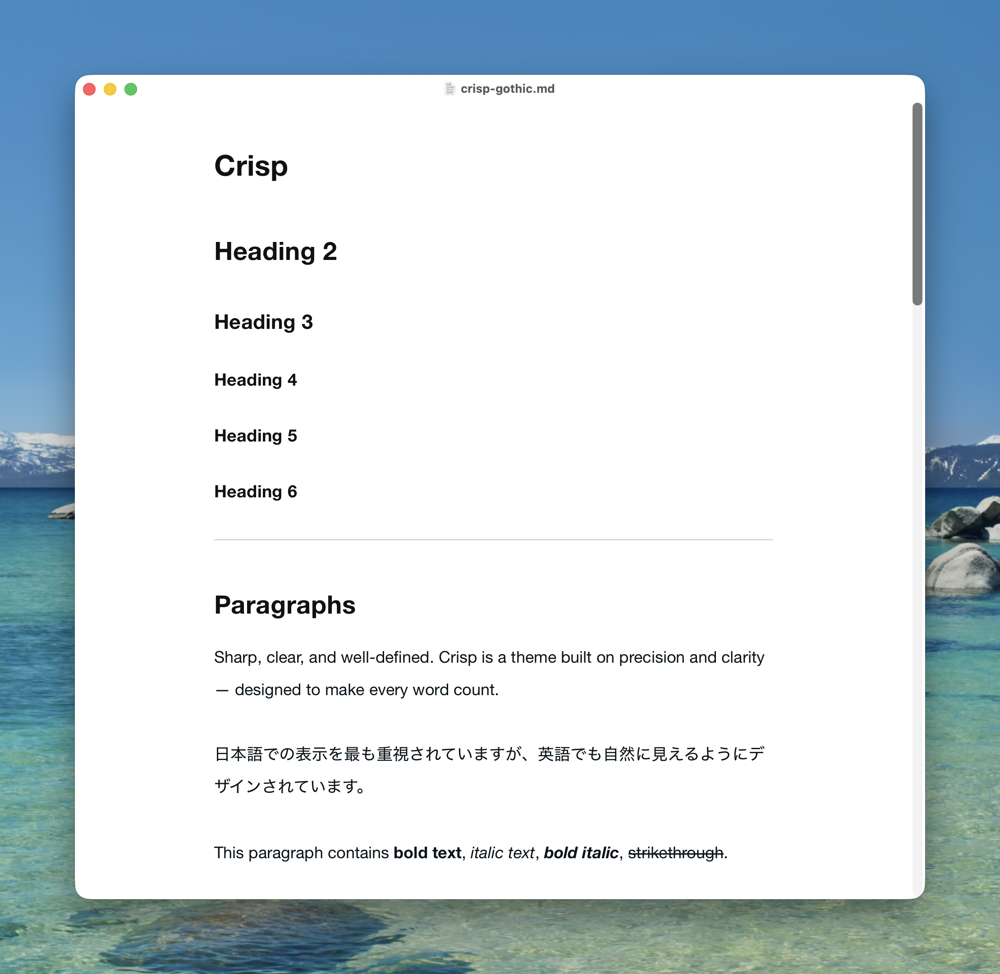
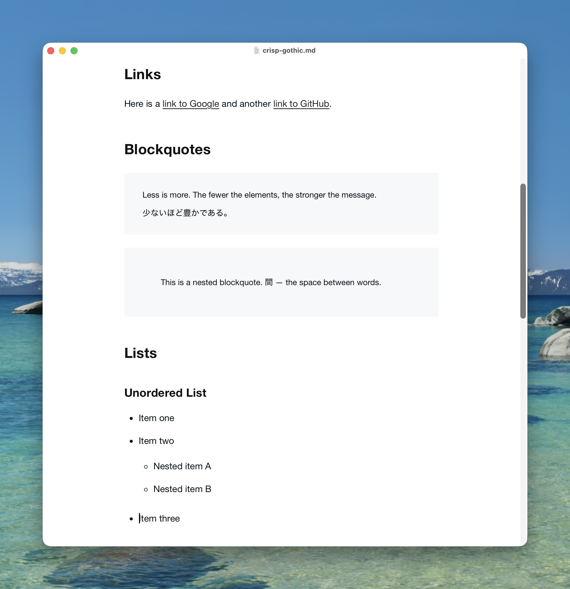
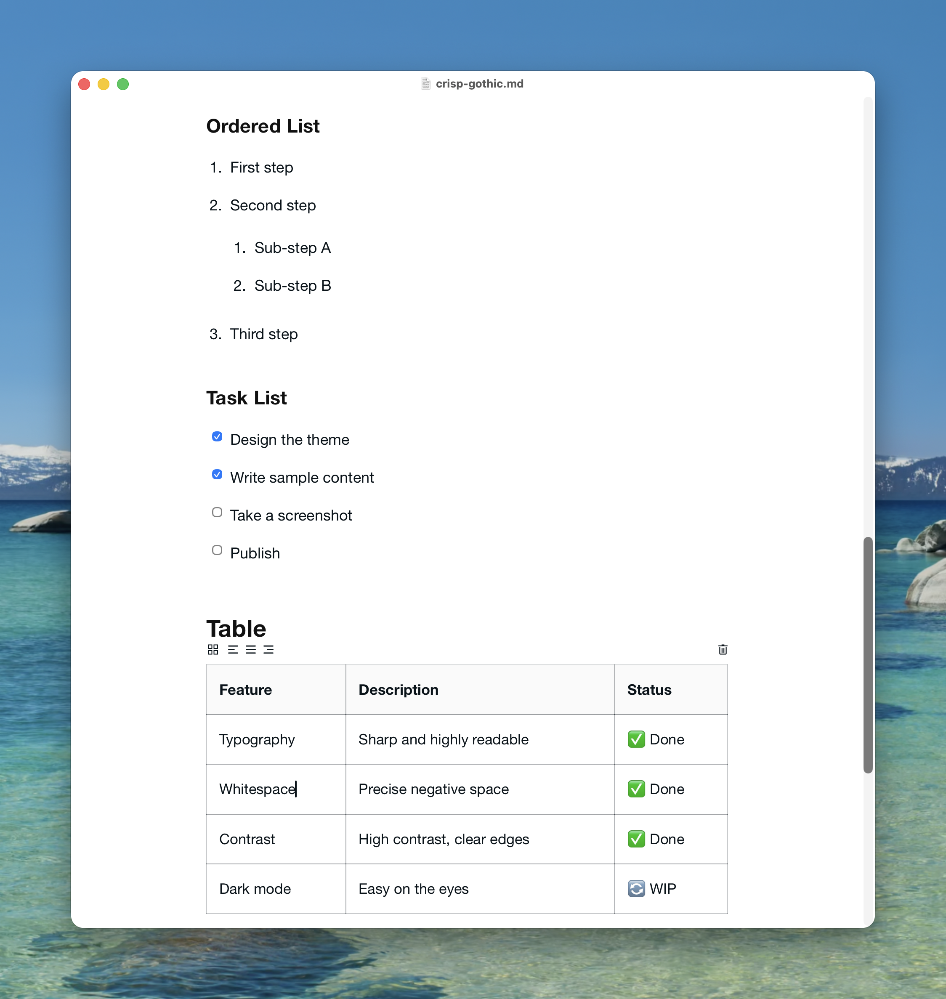
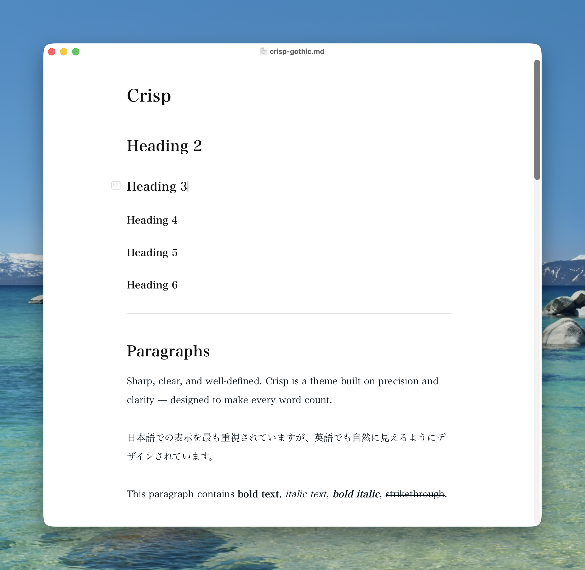
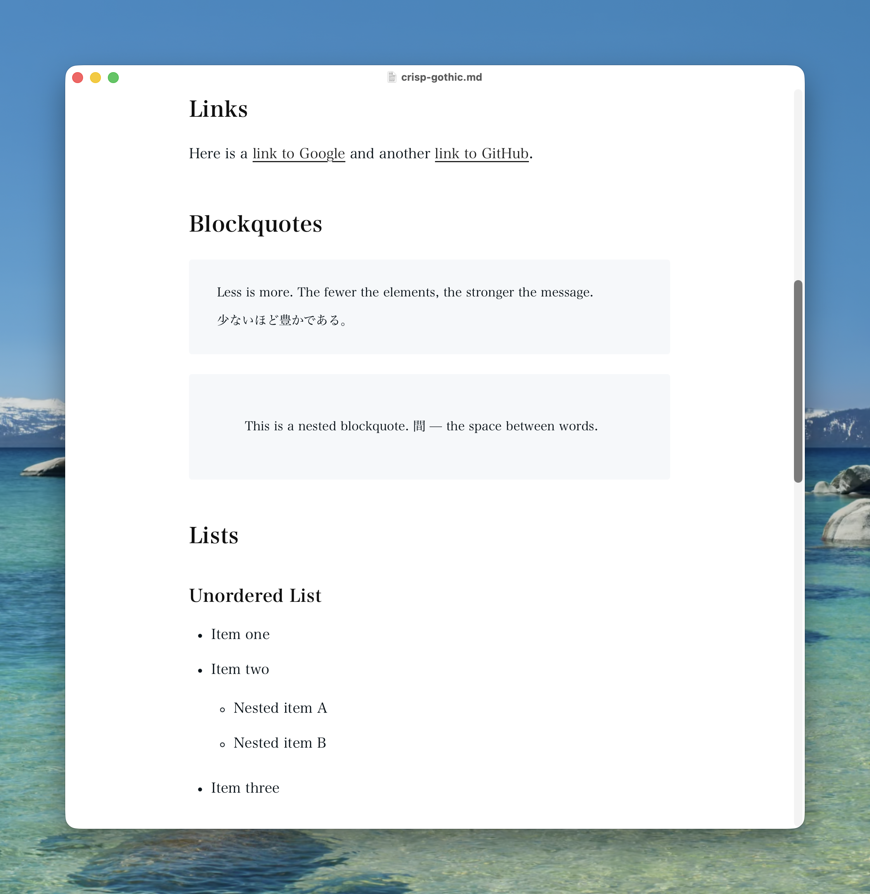
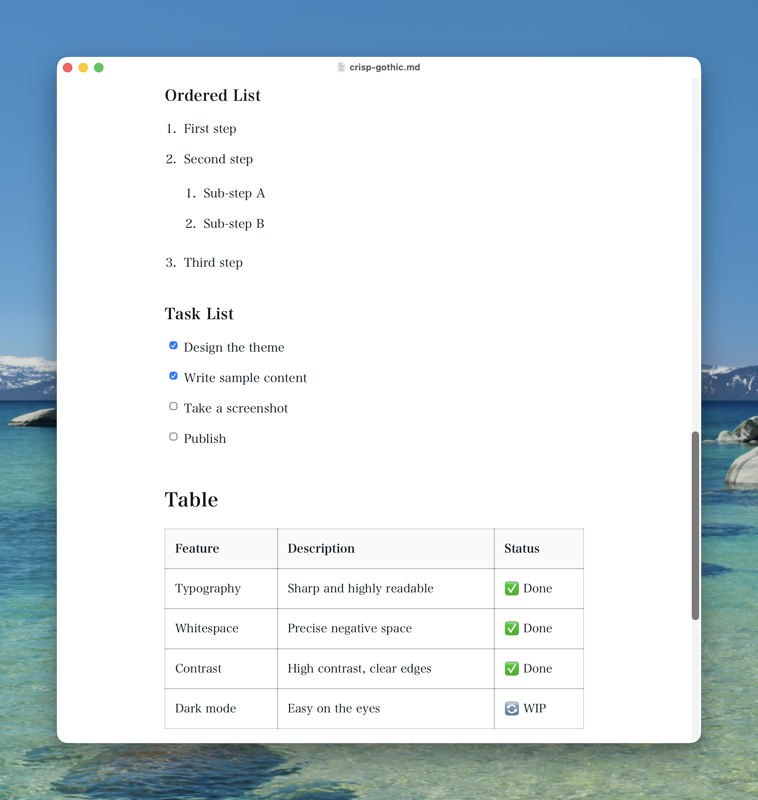

# Crisp Theme for Typora

*A minimal light theme for Typora. Pure white · Generous spacing · Built for reading.*

<!-- screenshot -->

> Clarity through restraint. Remove everything that competes with your words.

A [Typora](https://typora.io) theme inspired by [note](https://note.com)'s clean and readable writing experience.
This project is unofficial and is not affiliated with, endorsed by note.
Japanese-first.

* * *

## Themes

| Name | File | Font |
|---|---|---|
| **Crisp Gothic** | `crisp-gothic.css` | Gothic (sans-serif) | 
| **Crisp Mincho** | `crisp-mincho.css` | Mincho (serif) | 

## Screenshots

### Crisp Gothic

### Crisp Mincho

* * *

## Features

- **Pure white canvas** — `#ffffff` background, zero visual noise, full focus on content
- **Generous line height** — `line-height: 2` on body text for comfortable long-form reading
- **Japanese font stack** — Hiragino Sans, Noto Sans JP, Meiryo — renders naturally in both Latin and CJK scripts
- **Constrained measure** — body width capped at 620px, a proven comfortable reading line length
- **Optimized typography** — 18px base size, `text-rendering: optimizeLegibility`, antialiasing enabled
- **Print-ready** — `@media print` block ensures faithful rendering to paper or PDF export

* * *

## Installation

### Typora

1. Open Typora → **Preferences** → **Appearance** → **Open Theme Folder**
2. Copy `crisp-gothic.css` (and/or `crisp-mincho.css`) into the themes folder
3. Restart Typora
4. Select **Crisp Gothic** or **Crisp Mincho** from **Preferences → Appearance → Themes**

* * *

## License

MIT © [nitaking](https://github.com/nitaking)
